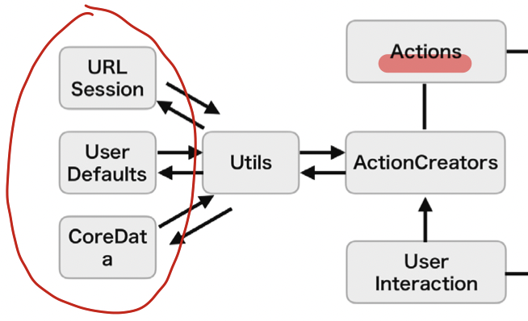

# Flux

## Flux とは
データフローが単一方向であるアーキテクチャ 
名称の由来はラテン語のFluxus(:流れ)という単語

## 基礎知識:データフロー

上にFluxのデータフローを示します。
Fluxは`Action` `Dispatcher` `Store` `View` の4つから構成されています。
また、上の図からAction→Viewにデータが単一方向に流れていることがわかると思います。

#### Action
実行するための処理を特定するためのtypeと、実行する処理に紐づくdataを保持したオブジェクト

#### Dispather
Action と Store の橋渡し
Action を受け取り、自身に登録されているStore に伝える

#### Store
View を変更するため、状態を管理
状態を保持して、Dispatcherから伝わったActionのtypeとdataに応じて、状態を変更する

#### View
Store を"購読"(非同期)することで画面を更新
Storeの状態を購読し、その変更に応じて画面を更新する

👇 Action を分かりやすく配置させたデータフロー

## iOSアプリでのデータフロー

#### Viewの構成とデータフロー

Storeの状態をViewに反映させることで、Viewの画面が更新される
Store→View は通知やObserverパターンを担うライブラリ(RxSwift, ReactiveSwift)を使用
Fluxアーキテクチャにおいて`状態を管理するのはStore`の役割なので、`Viewが状態を持つことはない`
Viewが状態を持たないので、FatViewControllerを防げる
**状態って何ですか？** : ミュータブル(変更可能)なオブジェクトの値, ミュータブルなので値が定まらない

#### Actionの構成とデータフロー

ユーザーからの入力(User Interaction) をもとに、ActionCreator の処理を実行
ActionCreater は Util を通して WebAPIから外部のデータ取得 や UserDefaultsからスマホ内に保存したデータ取得 を行う
ActionCreater は Actionを生成し、Dispathcherに送信する
ActionCreater→Dispatcher : dispatch(_ :)関数を使いActionを送信し、Dispatcherのregister(callback: )で登録されている全てのStoreに対してCallbackを通じてActionを伝える
※ ActionCreaterの役割 : FatViewControllerを防ぐため/Viewが直接Actionを生成することを防ぐため。もしActionCreaterが存在しなければ、「外部からのデータ取得」や「Action生成」といった処理をViewに書く必要があり、FatViewControllerになる。

#### Dispatcherの構成とデータフロー

Store に Action を伝える処理を行う
Store→Dispatcher : register(callback: )という関数を使い、Callbackを登録してActionを受け取る
Dispather→Store : 

#### Storeの構成とデータフロー

Dispathcerから受け取ったActionのtypeとdataをもとに自身を更新する。
Storeの更新がViewに反映され、Viewが更新される。
Storeが生成される前にDispatcherに対してActionを送ってしまうと、受け取り先がないままActionを送ることになる。そのためStoreが生成されるタイミングには注意が必要。

👇 View/Action/Dispatcher/Store の役割をメモしたiOSアプリでのデータフロー

